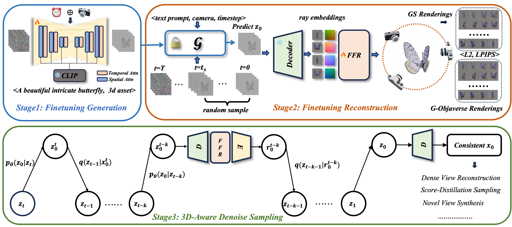

Our official Code has been released at https://github.com/alibaba/VideoMV, this repo will be deprecated~

## VideoMV: Consistent Multi-View Generation Based on Large Video Generative Model.

[Qi Zuo\*](https://scholar.google.com/citations?view_op=list_works&hl=en&user=UDnHe2IAAAAJ),
[Xiaodong Gu\*](https://scholar.google.com.hk/citations?user=aJPO514AAAAJ&hl=zh-CN&oi=ao),
[Lingteng Qiu](https://lingtengqiu.github.io/),
[Yuan Dong](https://mutianxu.github.io/),
Zhengyi Zhao,
[Weihao Yuan](https://weihao-yuan.com/),
[Rui Peng](https://prstrive.github.io/),
[Siyu Zhu](https://sites.google.com/site/zhusiyucs/home/),
[Zilong Dong](https://scholar.google.com/citations?user=GHOQKCwAAAAJ&hl=zh-CN&oi=ao),
[Liefeng Bo](https://research.cs.washington.edu/istc/lfb/),
[Qixing Huang](https://www.cs.utexas.edu/~huangqx/)

https://github.com/hitsz-zuoqi/VideoMV/assets/58206232/35087c84-5f93-46ac-8ee2-39b8ed7c2f52

## [Project page](https://aigc3d.github.io/VideoMV) | [Paper](https://arxiv.org/abs/2311.16918) | [YouTube](https://www.youtube.com/watch?v=zxjX5p0p0Ks) | [3D Rendering Dataset](https://aigc3d.github.io/gobjaverse)

## TODO  :triangular_flag_on_post:
- []  Release the training code.
- []  Release multi-view inference code and pretrained weight.

## Architecture

## Acknowledgement

This work is built on many amazing research works and open-source projects:

- [VGen](https://github.com/ali-vilab/VGen)
- [LGM](https://github.com/3DTopia/LGM)

Thanks for their excellent work and great contribution to 3D generation area.

We would like to express our special gratitude to [Jiaxiang Tan](https://github.com/ashawkey), [Yuan Liu](https://github.com/liuyuan-pal) for the valuable discussion in LGM and SyncDreamer.
